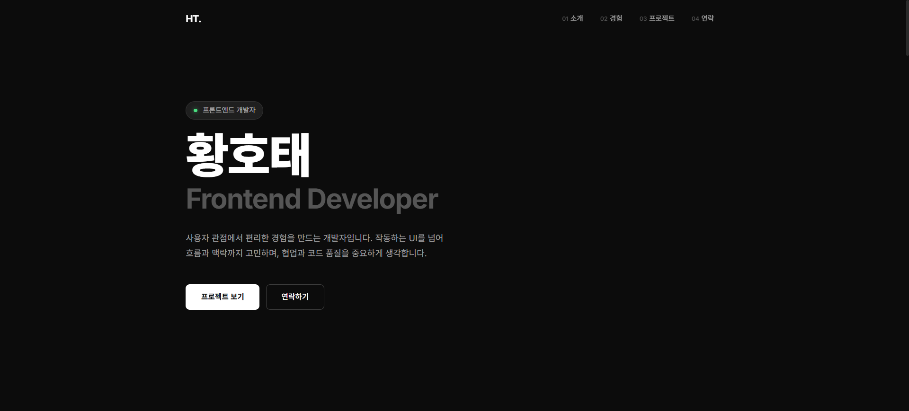

# 황호태 포트폴리오

프론트엔드 개발자 황호태의 개인 포트폴리오 웹사이트입니다.



<!--
TODO: 실제 배포 후 아래 배지의 링크를 실제 URL로 교체하세요.
-->


---

## 소개


사용자 관점에서 편리한 경험을 만드는 개발자입니다. 작동하는 UI를 넘어 흐름과 맥락까지 고민하며, 협업과 코드 품질을 중요하게 생각합니다.

- 강남대학교 ICT융합공학부 소프트웨어전공 재학 · 인공지능 부전공 (GPA 4.31 / 4.5)
- 주요 기술: JavaScript, TypeScript, React, React Native, Node.js, HTML & CSS
- Email: [ghxo03215@gmail.com](mailto:ghxo03215@gmail.com)
- GitHub: [@T1-hotae](https://github.com/T1-hotae)

<br clear="right" />

---

## 프로젝트 목록

| 프로젝트 | 설명 | 기간 | 기술 | 링크 |
| --- | --- | --- | --- | --- |
| **모요** | Slack·밴드 UX를 개선한 커뮤니티 웹 서비스 (게시물, 실시간 채팅, 캘린더) | 2025.09 ~ 2025.12 | React, TypeScript, Redux Toolkit, FastAPI, PostgreSQL, AWS EC2 | [GitHub](https://github.com/Moyo-project/Moyo_front) · [영상](https://youtu.be/EiS4uzRdQ9s?si=PsaotVYH29RZe28P) |
| **강림이** | 강남대 공지·알림 통합 모바일 앱 · 우수상 수상 · 실사용자 800명 (App Store · Google Play 출시) | 2025.12 ~ 2026.01 | React Native, Expo, FastAPI, PostgreSQL, AWS EC2 | [GitHub](https://github.com/CampusNotice/Frontend) · [App Store](https://apps.apple.com/kr/app/%EA%B0%95%EB%A6%BC%EC%9D%B4/id6758569535) · [Google Play](https://play.google.com/store/apps/details?id=com.campusnotice.fe) · [영상](https://youtube.com/shorts/K7Fhfh7sPzY?feature=share) |
| **두고먹고** | 냉장고 식재료 관리 및 AI 레시피 추천 앱 | 2025.12 ~ 2026.02 | React Native, Expo, TypeScript, AI Vision API | - |
| **코드바이트** | CS 개념 퀴즈 학습 모바일 앱 (게이미피케이션) | 2026.03 ~ 2026.06 | React Native, Expo, TypeScript, Zustand, Spring Boot | [영상](https://youtube.com/shorts/AqkF0Z2CXk0?feature=share) |
| **Pofol** | 포트폴리오 공유 & 팀 모집 플랫폼 (캡스톤 디자인) | 2026.03 ~ 2026.06 | Next.js, TypeScript, Spring Boot, PostgreSQL, Redis, Vercel | [Demo](https://pofol-community.vercel.app/) |
| **교학 점검 배정** | 강의실 점검표 자동 배정 알고리즘 웹 사이트 | 2026.03 ~ 2026.05 | React, JavaScript, Vite, CSS | [GitHub](https://github.com/T1-hotae/Gyohak1Team) · [Demo](https://gyohak1-team.vercel.app) |
| **Yeflix** | 영화 검색·OTT 바로가기·감상 일기 개인 서비스 | 2026.03 ~ 2026.04 | Next.js, Tailwind CSS, Firebase, TMDB API | [GitHub](https://github.com/T1-hotae/yeflix) · [Demo](https://yeflix-diary.vercel.app) |
| **글줍** | 직접 찍은 글자 사진을 오려 붙여 편지를 만드는 한글 랜섬노트 앱 (1인 개발, 스토어 제출 준비 중) | 2026.06 ~ 진행 중 | React Native, Expo SDK 54, TypeScript, Reanimated, AdMob, EAS Build | [GitHub](https://github.com/T1-hotae/ransomenote) |
| **미핑** | 실제 예상 이동시간을 비교해 공평한 중간 약속 장소를 추천하는 앱 (팀 프로젝트, 출시 준비 중) | 2026.07 ~ 진행 중 | Flutter, Riverpod, Firebase Cloud Functions, Firestore, 카카오맵 API | [GitHub](https://github.com/miping-team/miping) |
| **귀연록** | 이름·생년월일 기반 귀신 캐릭터 매칭 엔터테인먼트 웹 서비스 (사주 계산 엔진 직접 구현, 1인 개발) | 2026.08 ~ 진행 중 | Next.js, React, TypeScript, Supabase, PostgreSQL, Vercel | [Demo](https://guiyeonrok-app.vercel.app) |

각 프로젝트의 상세 내용(담당 역할, 아키텍처, 배운 점)은 사이트 내 프로젝트 상세 페이지 또는 [`src/data/projects.js`](src/data/projects.js)에서 확인할 수 있습니다.

---

## 기술 스택

**Frontend**

- React, React Native, Next.js
- Flutter (Dart)
- TypeScript, JavaScript
- Redux Toolkit, Zustand, TanStack Query
- TailwindCSS, Shadcn/UI

**Backend**

- FastAPI (Python)
- Spring Boot (Java)
- Firebase (Cloud Functions, Firestore)
- PostgreSQL, Redis

**DevOps / Infra**

- AWS EC2, Docker, Docker Compose, Nginx
- GitHub Actions (CI/CD)
- Vercel

**이 포트폴리오 사이트 자체**

- React 19, Vite 8
- React Router DOM 7
- GitHub Pages (`gh-pages`)

---

## 경력 및 활동

| 활동 | 기관 | 기간 |
| --- | --- | --- |
| EST AI Challengers: Road to AI 2기 | (주)이스트소프트 | 2026.08 ~ 2026.09 |
| SW개발자 6기 인턴 | 인턴IN메타 | 2025.07 ~ 2025.08 |
| MOTIV 학과동아리 부회장 | 강남대학교 | 2025.03 ~ 2025.12 |
| 교학1팀 근로 장학생 | 강남대학교 | 2025.03 ~ 현재 |

---

## 폴더 구조

```
src/
├── assets/         # 이미지 (프로필, 프로젝트 썸네일, 아이콘)
├── components/     # Navbar, Hero, About, Projects, Experience, Contact, Footer 등
├── data/           # projects.js, experiences.js (콘텐츠 데이터)
├── pages/          # Home, ProjectDetail
├── App.jsx
└── main.jsx
```

---

## 로컬 실행

```bash
npm install
npm run dev
```

## 빌드 & 배포

```bash
npm run build     # dist/ 생성
npm run deploy    # GitHub Pages(gh-pages 브랜치)로 자동 빌드·배포
```

---

## Contact

새로운 기회와 협업에 열려 있습니다. 언제든 편하게 연락 주세요.

- Email: [ghxo03215@gmail.com](mailto:ghxo03215@gmail.com)
- GitHub: [github.com/T1-hotae](https://github.com/T1-hotae)
